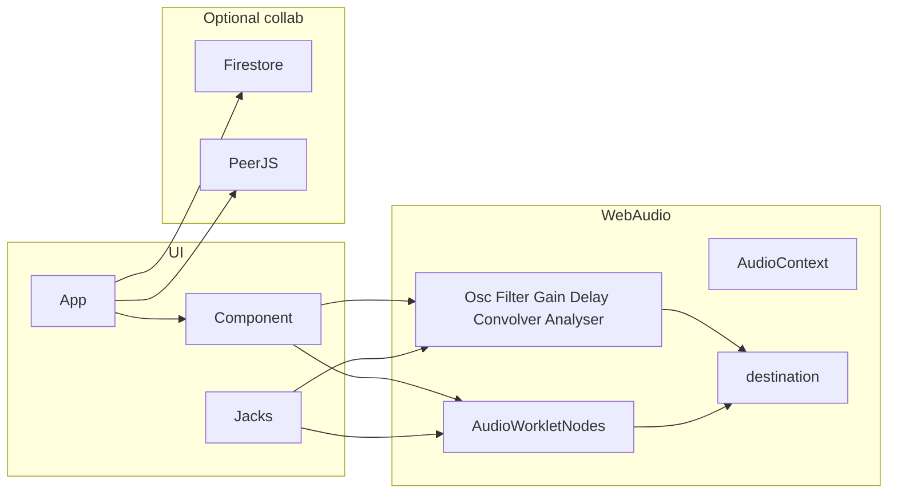

# modular_synth

Browser modular synthesizer. Oscillators, filters, envelopes, sequencers — plus modules that do not exist in hardware: mouse as CV, images as wavetables, webcam pixels as audio, a per-sample math formula.

Live: [https://brotochola.github.io/modular_synth](https://brotochola.github.io/modular_synth)

Click **▶** before anything will sound. The audio engine starts paused (browser autoplay rules).

---

## How to use it (producer)

This is a rack, not a DAW. You drop modules on an infinite canvas, patch cables, and listen. There is no mixer channel strip and no timeline. Save by downloading a JSON patch, or collab on a named URL.

### Canvas

| Action | How |
| --- | --- |
| Hear audio | **▶** in the footer. Button becomes **■** while running. |
| Add a module | **+ Modules**, or press **Space**. Palette is grouped: sources, processors, controllers, time, visuals. |
| Move | Drag a module by its body. |
| Zoom | Mouse wheel. Range is 0.25–1. |
| Cable | Click an **output jack** (right side), then an **input jack** (left side). One cable per input. |
| Unplug | Click a connected input again. |
| Delete | Click a module so it highlights, then **Delete**. Output cannot be deleted. |
| Undo / Redo | Footer **Undo** / **Redo**, or **Ctrl+Z** / **Ctrl+Y** (Ctrl+Shift+Z also redo). **History** lists each step; click a row to jump there. |
| Help | **?** on a module shows a short description. |
| Tempo | **change BPM**. Sequencer and MIDI Player follow this. |
| Save | **Download Patch** writes `my_patch.json`. Drop a `.json` onto the page to load. |
| Examples | Footer dropdown: *Load sample…* |

Jack labels matter. `in_0` is audio into the node. `frequency`, `gain`, `Q`, `trigger` are parameters you can modulate. A number field next to a jack is the static value when nothing is patched.

### Everything is audio

There is no separate CV bus. Mouse position, MIDI notes, sequencer pitches, image pixels — all come out as audio-rate signals. If a value is 0–1 and you need Hertz, multiply with a **Gain** module.

That is the whole trick. Patch like Eurorack: sources into processors into **Output**. Use Gain as a VCA and as an attenuverter/scaler.

### First sounds

**Hear something.** Oscillator → Output. Play.

**Subtractive voice.** Oscillator audio into Filter `in_0`. Filter into Amp `in_0`. Amp into Output. Set Filter to lowpass, raise Q a bit. This is the *mouse filter* idea without the mouse.

**Mouse as two hands.** Load sample **mouse filter**.

- Mouse **Y** → Gain (`gain` = 1000) → Oscillator `frequency`
- Mouse **X** → Gain (`gain` = 5000) → Filter `frequency`
- Oscillator → Filter → Output

Move the pointer. Pitch and cutoff follow. Drop a **Number Display** on a Gain output if you want to see Hertz.

**Sequenced pluck.** Load **seq-pluck**.

- Sequencer **Hz** → Oscillator `frequency`
- Sequencer **trigger** → ADSR `trigger`
- ADSR → Amp `in_0` (or into Amp `gain` with the osc into `in_0` — both work, different loudness)
- Oscillator → Amp → Filter → Output

The sequencer is 16 steps × 13 semitones, one note per step. Output 0 is a relative multiplier, output 1 is a gate, output 2 is Hz (`relative × baseHz`). Click the grid; change BPM in the footer.

**FM bass.** Load **fm-bass**. Modulator Oscillator → Gain (modulation index) → carrier Oscillator `frequency`. Carrier → Filter → Amp → Output. Slow sine into a triangle at ~55 Hz is a classic bass growl.

**Ring mod.** Load **ring-mod**. Two oscillators into a **Math Processor** with `y=x1*x2`. Product into Output. Detune one osc for clang.

**Image as oscillator.** **Image Player**: pick a PNG/JPEG. It walks pixels at audio rate and emits four signals **R, G, B, A**, each mapped from 0–255 to −1…1. Patch R into Output (loud, noisy) or into a Filter, or use channels as independent modulators. Reverse path: **Image Maker** has R, G, B, A inputs and paints a 215×121 canvas from the audio stream (~26k samples per frame).

**Mixer** is four channels plus master, with faders. Patch into `g0…g3` to automate a level. Use it instead of typing a mix formula.

**Math Processor** is the swiss army module. Four inputs `x1…x4`, one output `y`, evaluated every sample.

```
y=x1+x2+x3+x4          mix (or just use Mixer)
y=x1*x2                ring mod / VCA
y=(x1**3)/(x1+3)       waveshaping
y=x1 && x2 && x3*100   gate a joystick axis with two buttons
```

### Controllers

| Module | What comes out |
| --- | --- |
| **Mouse** | X and Y, 0–1, normalized to the window. |
| **Keyboard** | Gates on keys `a s d f z x c` (seven outputs). |
| **MIDI Input** | Up to four note frequencies, velocity, mod wheel, pitch bend. Extra CCs and pads appear as new jacks when you touch them. |
| **Gamepad** | One output per button, then analog axes. Plug in the pad first, then add the module. |
| **Mic / Line** | Live input. Pick a device in the dropdown. |
| **Audio Player** | Load a file, play with the button, or fire `trigger`. `offset` sets start time. |
| **Pad Sampler** | One sample, up to 8 playback voices. Each input is a playback speed; 0 rewinds that voice. |
| **MIDI Player** | Load a `.mid`. Outputs note Hz and a trigger. Follows global BPM. |
| **Webcam** | Same idea as Image Player: live R, G, B as audio. |

Scale 0–1 controllers with Gain before they hit `frequency` (Hz) or they will sit near DC.

### Collaboration

- **Local.** Open the site with no query string. The patch lives in this tab until you download JSON.
- **Shared rack.** Open `?patch=some-name`. Firestore syncs modules, cables, BPM, and uploaded audio/images for everyone on that name.
- **Conductor.** `?patch=some-name&admin=1`. Play/Stop on the admin machine is sent to guests over PeerJS.
- You own the modules you spawn (`createdBy`). Delete yours; Output is shared.

### Sample patches

| Dropdown | What it is |
| --- | --- |
| **mouse filter** | Saw osc through a lowpass. Mouse Y = pitch, mouse X = cutoff. Visualizers on the output. |
| **fm-bass** | Sine modulator into triangle carrier `frequency`, then lowpass. |
| **seq-pluck** | 16-step sequence into osc pitch + ADSR, slow LFO on filter cutoff. |
| **seq-filter-mod-adsr** | Same voice, envelope on Amp `gain`, extra LFO on ADSR sustain. |
| **ring-mod** | Two sines multiplied in the Math Processor. |
| **elefante** | Slow FM tone plus filtered noise, mixed to Output. |
| **house-dino mixer** | Same as house-dino; bus is a Mixer instead of a Math formula. |
| **talker** | Formant voice: saw glottis + noise, four parallel bandpass (F1–F4). Six sequencers spell *hello how are you*. |
| **shader lfo** | Three slow sines into Shader `x1…x3`, mouse Y into `x4` (zoom). Same LFO opens a saw through a lowpass. |

---

## How it works (technical)

Vanilla JS, no bundler. One `AudioContext`, a list of `Component`s, cables drawn on a canvas.



### Graph

[`js/app.js`](js/app.js) owns the `AudioContext` (created suspended), the component list, BPM, zoom, and the cable canvas. Footer **▶** calls `actx.resume()` / `actx.suspend()`.

[`js/component.js`](js/component.js) is the base class. Each module wraps one Web Audio node (or an `AudioWorkletNode`). When the node exists, the UI inspects it and builds jacks:

- native `AudioParam`s (`frequency`, `gain`, `Q`, …)
- audio inputs `in_0`, `in_1`, …
- worklet `parameters`
- optional `customAudioTriggers` (gate 0/1) and `customAudioParams` (any value), routed through small helper worklets so the main-thread JS can react

Output jacks are one checkbox per `node.numberOfOutputs`. Clicking an output stores `app.lastOutputClicked`; clicking an input calls `connect()`.

[`js/connection.js`](js/connection.js) + `figureOutWhereToConnect()` in [`js/utils.js`](js/utils.js) decide the native `node.connect(...)` target:

- patch into **Output** → `audioContext.destination`
- jack name starts with `in` → the target node, with that input index
- otherwise → that `AudioParam` (or a worklet parameter / custom-param worklet)

Cables are bezier curves on a full-size canvas, colored from the from/to/param names. Dragging a module redraws them.

### Native nodes vs worklets

Stock Web Audio where it is enough: `OscillatorNode`, `BiquadFilterNode`, `GainNode`, `DelayNode`, `DynamicsCompressorNode`, `AnalyserNode`, `ConvolverNode` (reverb IR: [`audios/reverb/Basement.m4a`](audios/reverb/Basement.m4a)), `ConstantSourceNode`, `MediaStreamAudioSourceNode` (mic), `AudioBufferSourceNode` (player / drawer wavetable).

Custom DSP lives in [`js/audioWorklets/`](js/audioWorklets/). The main thread loads the module once (`app.loadWorklet`), then constructs an `AudioWorkletNode`. Control data (mouse coords, MIDI, image pixels, sequencer grid) is `port.postMessage`’d in; audio comes out of worklet outputs so it can be patched like any other cable.

Examples: white noise, ADSR, 16-step sequencer, mouse, keyboard, joystick, MIDI, image player/maker, math processor, mixer, lerp, multiplexor, distortion, peak/pitch detectors, pad sampler.

### Math Processor

[`js/customProcessorComponent.js`](js/customProcessorComponent.js) rewrites `y` to `outputChannel[i]` and posts the string to [`js/audioWorklets/customProcessor.js`](js/audioWorklets/customProcessor.js). The worklet `eval`s a function `(x1,x2,x3,x4,outputChannel,channel1…,i)` and runs it for every sample in the render quantum. Four inputs, one output. Useful as mixer, VCA, waveshaper, or logic.

### Mixer

[`js/mixer.js`](js/mixer.js) is a four-input summing worklet ([`js/audioWorklets/mixerWorklet.js`](js/audioWorklets/mixerWorklet.js)). `g0…g3` and `master` are AudioParams (faders + CV). `out = (x0*g0 + x1*g1 + x2*g2 + x3*g3) * master`.

### Image I/O

**Image Player** downsamples the file to 215×121, packs `{r,g,b,a}` per pixel, and the worklet walks that array at sample rate. Four outputs, values `(channel/255)*2-1`. **Webcam** does the same from a `<video>` each frame.

**Image Maker** is the inverse: four audio inputs fill a 215×121 RGBA buffer (~26 691 pixels). At 48 kHz that is roughly two frames per second of new image, with opacity fading between updates. **Shader** is the GPU path: a fragment shader every video frame, uniforms `x1…x4` sampled from the rack (CV, not scanline), optional webcam as a texture.

**Drawer** is a 256-sample looping `AudioBufferSourceNode`. You draw a waveform on a canvas; columns become sample values.

### Patch JSON

Download / drop uses this shape:

```json
{
  "bpm": 100,
  "outputX": "1486px",
  "outputY": "834px",
  "components": [ { "constructor": "Oscillator", "id": "oscilla_…", "x": "…", "y": "…", "audioParams": {}, "connections": [] } ],
  "connections": [ { "from": "id", "to": "id", "audioParam": "frequency", "numberOfOutput": 0 } ]
}
```

`constructor` must match a key in `App.COMPONENT_CLASSES` ([`js/app.js`](js/app.js)). Extra fields listed in each module’s `valuesToSave` (formula, sequence, filename, …) round-trip with the rest. Load is bulk: spawn every component, wait until nodes exist, then wire connections.

### Collaboration stack

If the URL has `?patch=name`, Firestore collection `modular/{patch}` holds:

- the patch doc (component id list, BPM, Output position, writer `userID` / `sessionID`)
- subcollection `components` (full serialized modules)
- `users` (who is online, who is admin)
- `files` (audio/images as base64)

Listeners skip events whose `sessionID` is this tab, so you do not echo your own edits. `user_id` is stored in `localStorage`.

PeerJS ([`js/rtcForUsersData.js`](js/rtcForUsersData.js)) is a second channel: admin Play/Stop. Separate **RTC sender / receiver** modules stream the actual audio graph between peers (`MediaStreamAudioDestination` → `peer.call`).

---

## Module catalog

Grouped like the **+ Modules** palette.

### Sources

| Module | Role |
| --- | --- |
| **Oscillator** | Sine / square / saw / triangle. Patch into `frequency` / `detune`. |
| **Drawer** | Draw a 256-sample looping wavetable. |
| **Constant** | DC (`ConstantSourceNode`). Offset, mix, bias. |
| **Noise** | White noise worklet. |
| **Audio Player** | File playback, `trigger` and `offset`. |
| **Mic / Line** | `getUserMedia` source, device select. |
| **MIDI Player** | File → note Hz + trigger. |
| **Image Player** | Pixels → R/G/B/A audio. |
| **Webcam** | Live pixels → R/G/B audio. |

### Process

| Module | Role |
| --- | --- |
| **Filter** | Biquad: lowpass, highpass, bandpass, notch. `frequency`, `Q`. |
| **Gain Node** | Multiply. VCA and CV scaler. |
| **Compressor** | `DynamicsCompressorNode`. |
| **Delay** | `DelayNode` (`delayTime` 0–1 s in the UI). |
| **Reverb** | Convolver, basement impulse response. |
| **Distortion** | Waveshaping worklet; `amount` is modulatable. |
| **Math Processor** | Per-sample formula on four inputs. |
| **Mixer** | Four channels + master. Faders set `g0…g3` / `master` (also patchable). |
| **Lerp** | Smooth the input toward its target; `time` sets how slow. |
| **Pad Sampler** | One buffer, eight speed-controlled voices. |

### Control

| Module | Role |
| --- | --- |
| **Mouse** | X, Y (0–1). |
| **Keyboard** | Gates on `a s d f z x c`. |
| **Gamepad** | Buttons then axes. |
| **MIDI Input** | Notes, velocity, wheels, live CCs. |
| **RTC sender / receiver** | Stream this graph’s audio to another peer. |

### Time / logic

| Module | Role |
| --- | --- |
| **Sequencer** | 16×13 grid. Outputs: relative note, trigger, Hz (`baseHz` param). |
| **ADSR** | `trigger` starts the envelope. Attack, decay, sustain, release, attack curve. |
| **BPM Output** | Clock related to global BPM. |
| **Memory** | Holds the last non-zero sample (sample-and-hold). |
| **Counter** | `+` / `−` triggers increment a DC output. |
| **Multiplexor** | 8 inputs, `which` selects the output. `which` = 0 outputs silence. |

### Visuals / utilities

| Module | Role |
| --- | --- |
| **Number Display** | Prints the incoming value. |
| **Oscilloscope** | Time-domain analyser. |
| **Freq Analizer** | Spectrum bars. |
| **Spectrogram** | Scrolling spectrum. |
| **Large Visualizer** | Wide waveform, adjustable speed. |
| **Peak Detector** | Highest abs amplitude; `reset` trigger. |
| **Pitch detector** | YIN-style pitch → audio-rate Hz. |
| **Spectrum 2 Image** | FFT bins written into pixels. |
| **Image Maker** | Audio → RGBA canvas, scanline (~2 fps). |
| **Shader** | WebGL fragment shader, CV uniforms `x1…x4`, optional webcam texture. |
| **Text** | Label on the rack. |
| **Rack Cover** | Decorative panel over cables. |
| **Output** | Always present. This is the speakers. |

---

## Run locally

Static site. No build, no `package.json`.

Serve the repo root over HTTP (AudioWorklets will not load from `file://`):

- drop the folder in XAMPP `htdocs` and open `/modular_synth/`
- or any static server from the project root

Chrome or another Chromium browser is the intended target (MIDI, AudioWorklet, `getUserMedia`).
